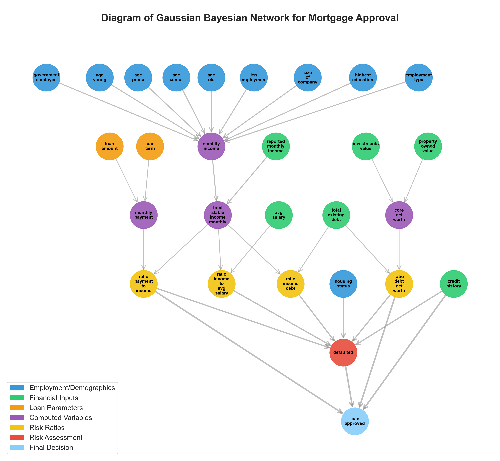

# Linear Gaussian Bayesian Network

## Abstract

This project implements and compares three different
  computational approaches for
  regression models: **Pure Python** (using only for-loops),
  **NumPy** (vectorized operations), and **Numba**
  (JIT-compiled Python). Each engine implements four regression models: **Linear Regression** and 
**Ridge Regression** are implemented from scratch using only basic 
mathematical operations, while **Lasso Regression** and **Elastic Net 
Regression** wrap sklearn implementations to provide consistent interface 
and enable performance comparison across all methods.

  This project extends beyond the scope of the **Linear 
  Algebra II** course at **CTU FIT**, where the least
  squares method was introduced theoretically. As an
  extension of the coursework, I explored practical
  implementation without relying on high-level machine
  learning libraries, demonstrating the mathematical
  foundations learned in class through code.

  The project provides **performance benchmarking** to
  demonstrate the computational advantages of different
  implementation strategies, particularly showcasing
  Numba's JIT compilation performance gains over pure
  Python implementations. Additionally, the program offers
  **curve fitting capabilities** for **sixteen pre-selected
   functions**, allowing users to fit various mathematical
  models to their datasets through an interactive menu
  system.

## Detailed Report

For a more detailed description of the methodology, results, and analysis, please refer to the [staifmatej-report.pdf](staifmatej-report.pdf) file included in this repository.

## Diagram of the Linear Gaussian Bayesian Network

- **government_employee**: Binary (Yes/No) - Whether the applicant works in government/public sector (teachers, firefighters, civil servants). In Czech context, these positions typically offer more stable income.
- **age**: Numeric (18-65) - Applicant's age in years
- **len_employment**: Numeric - Length of current employment in years
- **size_of_company**: Numeric - Company size (number of employees). Larger corporations are considered more stable than startups.
- **highest_education**: Categorical - Highest education level achieved (High School/Bachelor/Master/PhD)
- **employment_type**: Categorical - Employment status (Permanent/Freelancer/Unemployed/Temporary)
- **reported_monthly_income**: Numeric - Applicant's declared monthly income in CZK
- **total_existing_debt**: Numeric - Total current debt obligations in CZK
- **investments_value**: Numeric - Total value of investments in CZK
- **property_owned_value**: Numeric - Total value of owned properties in CZK
- **housing_status**: Categorical - Current housing situation (Own/Rent/With Parents)
- **credit_history**: Categorical - Credit score/history (Excellent/Good/Fair/Poor)
- **loan_amount**: Numeric - Requested loan amount in CZK
- **loan_term**: Numeric - Requested loan duration in years
- **avg_salary**: Numeric - Average salary in the region/sector (default 40,000 CZK)

## Installation & Usage

- Clone the repository using SSH or HTTPS
    - **SSH:** `git@github.com:staifmatej/mortgage_approval_bayesian_network.git`
    - **HTTPS:** `https://github.com/staifmatej/mortgage_approval_bayesian_network.git`

- Navigate to the project directory (to the root folder)

    - `cd mortgage_approval_bayesian_network`

- Create virtual environment and install dependencies:

    - `python3 -m venv venv`
    - `source venv/bin/activate`
    - `pip install -r requirements.txt`

- Run program, test unit tests or check for PEP8 score:
 
    - `python main.py` (to start program)
    - `pytest` (to run unit tests)
    - `pylint . --disable=C0301,C0103` (PEP8 score)

## Testing

To run the tests, execute `pytest` directly in the main project directory (**root folder**).

## Codestyle

To check code style compliance, run `pylint . --disable=C0301,C0103` from the **root folder**.
This will analyze all Python files while ignoring line length (C0301) and naming convention (C0103) warnings.
  

**Note**: These pylint warnings are occasionally suppressed
  directly in the code. I tried to minimize pylint warning
  suppressions, but sometimes I determined that suppression
   was the best choice, as making the changes would not
  help improve my program design skills and would only make
   the program structure more chaotic.
