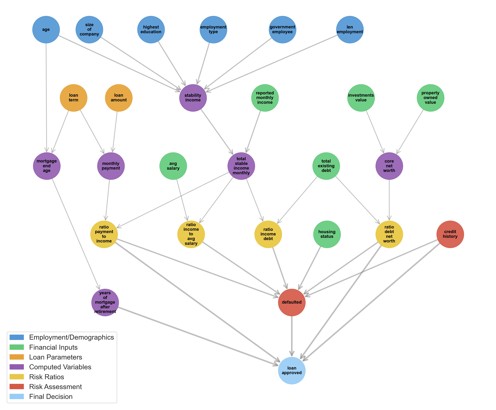

# Linear Gaussian Bayesian Network

## Abstract

This project simulates an internal mathematical model for Bayesianhill Bank that trains a **Linear Gaussian Bayesian Network (LGBN)** using the **pgmpy library** on CSV data from clients who have already repaid or defaulted on their mortgages. Based on this historical data, the **model calculates the probability that a new mortgage applicant will successfully repay their loan** when a banker inputs their information into the system, including loan amount and repayment period to assess risk based on borrowing parameters.

The model is trained on a CSV file that is synthetically yet realistically generated, though the program also offers training on any other arbitrary CSV file within the folder. The goal of this project was to implement and familiarize myself with Bayesian Networks (initially I experimented with Discrete Bayesian Networks using the Pomegranate library). It is important to note that the model is trained on synthetic data and evaluates mortgage approval probability based on this training, which should be taken into consideration. Nevertheless, the model is highly realistic, and I successfully fine-tuned it to demonstrate the practical power of Bayesian Networks in a compelling and realistic manner.

## Detailed Report

For a more detailed description of the methodology, results, and analysis, please refer to the [staifmatej-report.pdf](staifmatej-report.pdf) file included in this repository.

## Diagram of the Linear Gaussian Bayesian Network

- `🟦 Employment & Demographics` - Core applicant characteristics including age, company size, education level, employment type (permanent/temporary/freelancer/unemployed), government employee status, and length of employment. These factors establish the foundation for income stability assessment.
- `🟩 Financial Inputs` - Primary financial data encompassing average salary benchmarks, reported monthly income, investment portfolios, property ownership values, existing debt obligations, and current housing status. These inputs provide the raw financial picture of the applicant.
-  `🟧 Loan Parameters`  -  Fundamental loan specifications including the requested loan amount and proposed loan term (1-35 years). These parameters directly
- `🟪 Computed Variables` - Derived metrics calculated from input data: mortgage end age, monthly payment amounts, income stability scores (0-1), total stable monthly income, core net worth calculations, and years of mortgage payments extending beyond retirement. These variables provide deeper insights into loan feasibility.
- `🟨 Risk Ratios` - Critical financial ratios for risk assessment: income-to-debt ratios, debt-to-net-worth ratios, income compared to average salary, and payment-to-income ratios. These standardized metrics enable consistent risk evaluation across different applicant profiles.
- `🟥 Risk Assesment`  - Comprehensive risk evaluation including credit history categorization (bad/fair/good/excellent) and default probability calculations derived from multiple contributing factors throughout the network.
- **Final Decision** - The ultimate loan approval decision represented as a probability score (0-1), indicating the likelihood that the mortgage applicant will successfully repay the loan without defaulting.
  
More detailed information is provided in the report [staifmatej-report.pdf](staifmatej-report.pdf) in this repository.

## Installation & Usage

- Clone the repository using SSH or HTTPS
    - **SSH:** `git@github.com:staifmatej/mortgage_approval_bayesian_network.git`
    - **HTTPS:** `https://github.com/staifmatej/mortgage_approval_bayesian_network.git`

- Navigate to the project directory (to the root folder)

    - `cd mortgage_approval_bayesian_network`

- Create virtual environment and install dependencies:

    - `python3 -m venv venv`
    - `source venv/bin/activate`
    - `pip install -r requirements.txt`

- Run program, test unit tests or check for PEP8 score:
 
    - `python main.py` (to start program)
    - `pytest` (to run unit tests)
    - `pylint . --disable=C0301,C0103` (PEP8 score)

## Testing

To run the tests, execute `pytest` directly in the main project directory (**root folder**).

## Codestyle

To check code style compliance, run `pylint . --disable=C0301,C0103` from the **root folder**.
This will analyze all Python files while ignoring line length (C0301) and naming convention (C0103) warnings.
  

**Note**: These pylint warnings are occasionally suppressed
  directly in the code. I tried to minimize pylint warning
  suppressions, but sometimes I determined that suppression
   was the best choice, as making the changes would not
  help improve my program design skills and would only make
   the program structure more chaotic.
